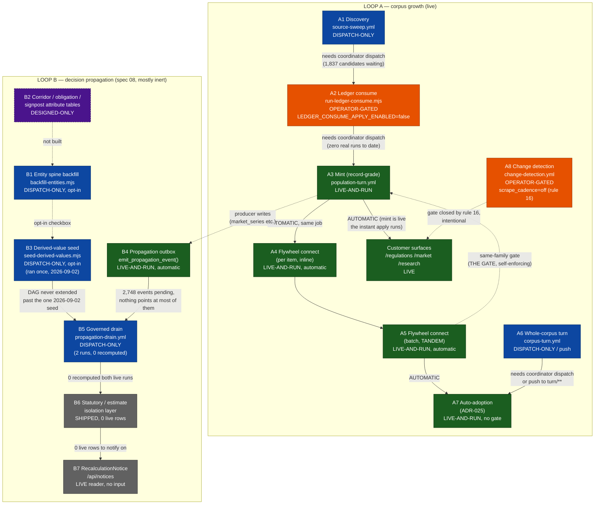

# C1 — The loop map: the flywheel as it actually runs today

**Audit:** wiring-audit-2026-09-04 · **Lane:** AUDIT-C1 · **Window:** every commit since 2026-08-21 (107 PRs, `_prs.txt`) · **Mode:** read-only (repo + doctrine + live read-only SQL against `kwrsbpiseruzbfwjpvsp`)

**Sources read in full:** `docs/specs/08-flywheel-design.md`, `docs/decisions/ADR-023/024/025`, `CLAUDE.md` rules 16–18, `docs/PROGRAM-BOARD.md` (lines 1–200 and every 2026-09-0x row), the six live runtime workflows (`.github/workflows/{population-turn,source-sweep,ledger-consume,propagation-drain,corpus-turn,change-detection}.yml`), `scripts/turns/{run-population-flywheel,deliver-artifact-branch.sh}`, `src/lib/intake/{run-intake-cycle,apply-staged-update,portal-harvest}.ts`, and read-only SQL against the live tables named throughout.

Status labels used below, per rule 14: **[CONFIRMED]** = re-verified this session against the live system, a live query, or a file read in full; **[HYPOTHESIS]** = read from code/docs, plausible, not independently re-run.

---

## 0. Two loops, not one — the operator's question spans both

`08-flywheel-design.md` §0 is explicit that there are two distinct loops and conflating them is the standard error:

- **Loop A, discovery compounding** — corpus grows → connections cluster into themes → gaps become discovery targets → the corpus grows again. This is the loop that actually runs live today: source-sweep → ledger-consume → mint → discovery/forward-events/recluster/tags/obligations.
- **Loop B, decision propagation** — a fact changes → every derived value that depended on it is invalidated → recomputed → the reader is told which of *their* decisions moved. This is spec 08's own subject, fully designed and mostly built, and — this is the headline finding of this lane — **almost entirely inert in production** [CONFIRMED, live counts in §4].

The operator's question ("is everything built in the last two weeks wired, and does it fit within the flywheel loop") is answered against **both** loops below, because the last two weeks built runtime for both and they close very differently.

---

## 1. Loop A — corpus growth — stage by stage

| # | Stage | Component | State | Artifact family | Live evidence |
|---|---|---|---|---|---|
| A1 | **Discovery (source-sweep)** | `.github/workflows/source-sweep.yml` → `run-source-sweep.mjs` / `research-sweep.mjs`; walkers `register-eurlex`, `register-federal-register`, `feed`, `research`, `sitemap` → writes `portal_link_candidates` | **DISPATCH-ONLY**, no schedule (rule 16 compliant — schedule block present but commented out) | `source-sweep` (`scripts/harness-runs/source-sweep/`, 11 runs on record) | `portal_link_candidates` = 1,840 rows, **1,837 still `status='candidate'`** [CONFIRMED, live SQL] |
| A2 | **Ledger consume** | `.github/workflows/ledger-consume.yml` → `run-ledger-consume.mjs` → `consumePortalCandidates` (ledger row → Haiku classify → the SAME `runIntakeCycle`/`applyStagedUpdate` chokepoint mint uses) | **OPERATOR-GATED** — `LEDGER_CONSUME_APPLY_ENABLED = false`, a source constant (ADR-023's reviewed-change gate). Even a `mode: apply` dispatch runs with plan semantics until an operator flips it in a reviewed diff | `ledger-consume` — **registered, zero real runs**; only `PENDING-RUN.md` exists, no `ledger-consume-run-001.json` [CONFIRMED, dir listing] | 1,837 candidates wait behind this one flag |
| A3 | **Mint (record-grade population)** | `.github/workflows/population-turn.yml` → `stamp-wo26-archive-reason.mjs` → `export-census-rows.mjs` (reads `census_worklist`) → `run-mint-batch.mjs --grade record` → `apply-mint-batch.mjs` (same chokepoint as A2) | **LIVE-AND-RUN** — dispatched to `mint-run-042`+ as of 2026-09-04 | `mint` | `intelligence_items` = 2,766 total, **1,435 live-verified**; `census_worklist` pool still 21,609 rows [CONFIRMED] |
| A4 | **Flywheel connect, per-item (inline)** | `apply-staged-update.ts`'s own inline discovery + forward-event-extraction call, fired for every substantive intake through the ONE chokepoint A2 and A3 both use | **LIVE-AND-RUN, automatic** — not a separate dispatch; happens inside the same DB transaction as the mint write | flags on the item (`flywheel-defect:` namespace), not its own harness family | — |
| A5 | **Flywheel connect, batch-level (TANDEM)** | `run-population-flywheel.mjs`, run automatically as the LAST step of the SAME `population-turn.yml` job, right after A3: discovery (re-run, idempotent) → forward-event extraction/apply → `analyze-corpus.mjs` (recluster + gaps + L4 signals) → `derive-obligations.mjs` → `tag-proposals.mjs --arg ids:<batch>` → `tag-ratification.mjs --arg auto` → §9 outcomes write → `LAST-TURN.json` advance | **LIVE-AND-RUN, automatic handoff inside one run** — this is the "mint → flywheel in population-turn" link named in the brief | enriches `mint`'s own artifact + self-emits `forward-events` | `item_cross_references` = 20,401; `item_forward_events` = 1,149; `connection_themes` = 21 [CONFIRMED] |
| A6 | **Whole-corpus turn** | `.github/workflows/corpus-turn.yml` — same discover/forward-events/analyze-corpus stages, UNSCOPED, either `workflow_dispatch` or `push` to a `turn/**` branch (push always applies) | **DISPATCH-ONLY** (or push-triggered); no schedule (rule 16) | reuses `forward-events`, plus `scripts/turns/LAST-TURN.json` marker | 6+ real turns run, latest 2026-09-03 ("FLYWHEEL TURN RAN") |
| A7 | **Auto-adoption of derivations** | `tag-ratification --arg auto`, `analyze-corpus.mjs --signals` apply, `apply-classifications.mjs --auto-adopt` | **LIVE-AND-RUN, no human gate (ADR-025)** — residue stays a flag, never a precondition | writes directly into `intelligence_items.*_tags`, `integrity_flags` resolution | classifications apply 2026-09-04: 1,015 flags, 797 auto-adopted, 218 open [board, 2026-09-04] |
| A8 | **Change detection (existing sources)** | `.github/workflows/change-detection.yml` → deployed `/api/worker/check-sources` route → `runReconcilePass` → `drainChangeSweepUpdates` | **OPERATOR-GATED — `system_state.scrape_cadence='off'`** (CLAUDE.md rule 16, build-mode hold). The route exits at 0 sources checked while the gate is closed; reconcile/drain still work any existing backlog | `change-detection` (5 runs on record) | Gate `CLOSED`, 959 due sources / 0 checkable [board, "CD-GATE"] — **this is a rule-16-compliant, intentional non-closure, not a defect** |
| A9 | **Landing (train / PR / merge)** | Every workflow above ends in `deliver-artifact-branch.sh`: opens a PR, or — when the repo setting refuses Actions-created PRs — files the branch on one tracking issue and finishes green | Every family's **coordinator dispatch → coordinator/human lands the branch** step | — | See §3, "the stamps-on-master gate" |

**Loop A verdict:** closed from A3 onward (mint → flywheel → auto-adoption is fully automatic inside one run, and record-grade items are live on customer surfaces — Regulations/Market/Research render `intelligence_items` directly, with no propagation-engine hop needed). **Open at A1→A2** (a hard operator gate) and **A2→A3** (no automatic handoff exists even once A2 is unlocked — see §5).

---

## 2. Loop B — decision propagation — stage by stage

| # | Stage | Component | State | Artifact family | Live evidence |
|---|---|---|---|---|---|
| B1 | **Entity spine backfill** | `scripts/entities/backfill-entities.mjs`, opt-in checkbox inside `propagation-drain.yml` (`backfill_entities`) | **DISPATCH-ONLY, opt-in** — has run | none of its own (writes `entities`/`entity_identifiers`/`entity_refs` directly) | `entities` = 2,022 (organisation 1,293 / instrument 665 / jurisdiction 63 / **corridor 1**); `entity_identifiers` = 2,016; `entity_refs` = 1,185; **`entity_scope` = 0** [CONFIRMED, live SQL] |
| B2 | **Corridor / obligation / signpost attribute tables** | Spec §1.2's per-kind tables (`corridors`, `obligations`-as-entity, `signposts`) | **DESIGNED-ONLY** — `entities.kind` accepts these values with **no attribute table behind them** (spec's own table row, unchanged this window) | — | `entities.kind='corridor'` = 1 thin row; `kind='obligation'`/`'signpost'` = **0 rows** [CONFIRMED] |
| B3 | **Derived-value seeding** | `scripts/propagation/seed-derived-values.mjs`, opt-in checkbox in `propagation-drain.yml` (`seed_derived_values`) — writes the FIRST `derived_values` row + `derivation_edges` per registered method | **DISPATCH-ONLY, opt-in — ran once (2026-09-02), never since** | — | `derivation_edges` = 6, `derived_values` = 6 (the two seed rows for `carbon_intensity_tkm@1.0.0` / `automate_vs_hire@1.0.0`) [CONFIRMED] |
| B4 | **Propagation outbox (trigger)** | `emit_propagation_event()` on spine-connected tables (`market_series`, `emission_factors`, `regional_data_facts`, `derived_values`) | **LIVE-AND-RUN, fully automatic** — no dispatch, no coordinator; fires in the same transaction as any producer write | `propagation_events` table itself | 2,754 total events, **2,748 still pending** (2,737 of those from the single 2026-09-04 EIA producer apply) [CONFIRMED] — **this IS the one closed link in Loop B with zero human step anywhere in it** |
| B5 | **Governed drain** | `.github/workflows/propagation-drain.yml` → `run-propagation-drain.mjs` → `runPropagationDrain` (invalidate closure → topological recompute via registered methods) | **DISPATCH-ONLY — run exactly twice, both 2026-09-02, both against the 6 seed events (0 invalidated, 0 recomputed each time)** | `propagation` (2 runs on record; `propagation-run-002` supersedes a renumbering defect in run 001) | Never dispatched against the 2,748-row live backlog. **Even if dispatched today it would clear the backlog but recompute nothing** [CONFIRMED — see §4] |
| B6 | **Statutory / estimate isolation layer** | `statutory_computations`, `estimated_values` tables, the four-layer isolation (physical tables / TS type barrier / DB trigger / component gate), `admissibleFor()` | **SHIPPED, schema+code; zero live rows** | — | `statutory_computations` = 0, `estimated_values` = 0 [CONFIRMED] — the FuelEU Annex IV penalty worked example in spec §4 has never rendered a real figure in production |
| B7 | **Customer surface read** | `<StatutoryFigure>`/`<EstimatedFigure>`/`<DerivedFigure>`, `RecalculationNotice`, `GET /api/notices` | **LIVE-AND-RUN as a reader, but starved of input** — `AutomateVsHireCalculator.tsx` computes client-side on every keystroke (never reads `derived_values` at all); Market's "Per-unit carbon intensity" block on the corridor Drivers tab is the one component that genuinely reads `DerivedFigure`/`derived_values` | — | `/api/notices` reads superseded (old→new) `derived_values` pairs; **0 pairs exist**, so it always returns empty |

**Loop B verdict:** **open everywhere except the trigger.** Schema, gate, isolation, and drain logic are all shipped and correct — but the DAG that tells the drain what depends on what (`derivation_edges`) was seeded once, thinly, on 2026-09-02, and has never been extended to cover anything minted or produced since (2,737 new market-series rows, 7 new emission-factor rows, 1,149 obligations, 665 instrument entities). Every one of those writes fires the outbox trigger correctly and then sits in `propagation_events` doing nothing, because nothing in the DAG points at it.

---

## 3. The handoff table — who does it today, what removes the human

| Handoff | Kind | Who does it today | What it would take to remove the human |
|---|---|---|---|
| mint → flywheel (A3→A5) | **automatic, inside one run** | Nobody — `population-turn.yml`'s own job, no `\|\| true` on the flywheel step | Already removed. |
| discovery/forward-events, per item (A3/A2→A4) | **automatic, inline** | Nobody — fires inside `apply-staged-update.ts`'s own chokepoint | Already removed. |
| tag/signal/classification adoption (A7) | **automatic, no gate** | Nobody, per ADR-025 | Already removed. |
| A1 → A2 (source-sweep → ledger-consume) | **needs a coordinator dispatch** | Coordinator manually dispatches `ledger-consume.yml` after reading `source-sweep`'s artifact | A `workflow_run` trigger on `source-sweep.yml`'s completion, firing `ledger-consume.yml` automatically. Not a schedule (rule 16 is about `schedule:`/cron, not event chaining) — see §5. |
| A2 → A3 (ledger-consume → mint) | **needs a coordinator dispatch** | Nobody dispatches `population-turn.yml` in response to a ledger-consume run; the two are functionally independent workflows (though A2's own mint reuses A3's chokepoint, it does NOT reuse A3's TANDEM batch-level recluster/obligations/tag pass — A2 gets only the A4 inline touch) | Same mechanism as above, chained. A batch-level TANDEM pass over what A2 minted still needs to run (A2 has no equivalent of A3's §8/§9 step today) — either extend `consumePortalCandidates` to call `run-population-flywheel.mjs`-equivalent logic, or rely on the next `corpus-turn` (A6) to sweep it in, unscoped. |
| any workflow's harness-run artifact → master ("stamps-on-master gate") | **needs a coordinator to land a branch** | `deliver-artifact-branch.sh`: opens a PR when permitted, else files the branch on one tracking issue; a human/coordinator merges it | The one Settings toggle named in the workflow's own comments ("Allow GitHub Actions to create and approve pull requests") removes the fallback path entirely — PRs open themselves; a human still merges unless branch protection is relaxed too (not recommended — this is exactly the review gate rule 4/15 want kept). Note: the underlying DB writes are **already live** the instant `apply` mode runs — this gate only delays the *artifact JSON* landing on master, which matters for cross-family staleness checks (F28) and for the board, not for whether the data is live. |
| a NEW mint batch while a prior one is unconnected (THE GATE, A5) | **self-enforcing, not a human gate** | `run-population-flywheel.mjs --check-gate` refuses the apply step; the fix is dispatching `flywheel_backlog: true`, still a coordinator action today | Could be auto-triggered the same way as the chaining above — a `workflow_run` on population-turn failure/gate-refusal firing a backlog dispatch. Lower priority: THE GATE already prevents silent drift, it just requires a manual clear. |
| schema change → dependent code (two-track migration policy, rule 3) | **coordinator/human-only, by design** | Supabase CLI apply by a person with DB credentials, before the dependent code merges | Cannot be removed without giving an agent standing DB-DDL credentials — a deliberate constraint (ADR-023's own Context section: the sandbox has neither network egress to sources nor to Supabase), and relaxing it is an operator decision, not a wiring fix. |
| B1/B3 (entity backfill / derived-value seed) → B5 (drain) | **needs a coordinator dispatch, opt-in checkboxes** | A human ticks `backfill_entities`/`seed_derived_values` on a `propagation-drain.yml` dispatch, or runs the scripts directly | These could be made unconditional steps of every drain dispatch (always attempt backfill+seed before draining) with no operator judgement call involved — they are pure, idempotent, already dry/apply-gated. This alone does not close Loop B though — see next row. |
| new producer/mint data (`market_series`, `emission_factors`, obligations, tags) → `derivation_edges` | **NOBODY does this today — not even a coordinator** | Nothing in the repository extends the DAG when new source data lands; only the one hand-run `seed-derived-values.mjs` pass from 2026-09-02 ever wrote an edge | This is a **build gap**, not a missing dispatch: the two registered methods (`carbon-intensity.ts`, `automate-vs-hire.ts`) or their producers need to register a `derivation_edges` row (and, for a genuinely new subject, a `derived_values`/`estimated_values` row) at write time — the same call `seed-derived-values.mjs` already makes, just triggered by ingestion instead of a one-off script. |
| B5 (drain) → B7 (customer notice) | **would be automatic once B4/B5 are wired**, but nothing populates the DAG to drain (see above) | Nobody — the mechanism exists, the input doesn't | Downstream of the DAG-authorship fix above; no separate human step needed once that lands. |

---

## 4. Where the loop is closed, where it's open — plainly

**Closed, with evidence:**
- Mint → per-item connect → batch-level recluster/obligations/tags, all inside one `population-turn` dispatch, no human touch (A3–A5, A7).
- The propagation outbox trigger (B4) — genuinely zero-touch; it just has nothing pointed at it downstream.
- A record-grade item reaching a customer page: **one dispatch of `population-turn.yml`, once ledger-consume/mint-source data exists, is already sufficient** — Regulations/Market/Research render `intelligence_items` directly; no propagation-engine hop is on that path at all.

**Open, with evidence:**
- A1 → A2: hard operator gate (`LEDGER_CONSUME_APPLY_ENABLED=false`), zero real runs of `ledger-consume` to date.
- A2 → A3, and every other cross-workflow boundary: six independent `workflow_dispatch`-only workflows with no chaining between them — each needs a person (or a future event trigger) to fire the next one.
- Loop B end to end past B4: the DAG (`derivation_edges`) has 6 rows total, seeded once, seven days ago as of this window, and never extended. The drain has run twice against those same 6 rows. `statutory_computations`/`estimated_values` are empty. The spec's own worked example ("a Research assessment revises the emission factor it relied on... Rotterdam–Milan payback moves 3.4y → 3.9y") **cannot happen on the live system today** — there is no live statutory/estimate row for it to happen to.
- Corridor/obligation/signpost as spine entities: designed, not built (B2) — the live `obligations` table (migration 290, 1,149 rows) is a **different, simpler table** than spec §1.2's entity-kind obligation, and the two are not connected. This is a naming collision worth flagging on its own: "obligations" means two different things in this codebase today, one live, one designed-only.

---

## 5. Minimum changes to get one `source-sweep` dispatch all the way to a customer surface, no coordinator, without breaking rule 16 or ADR-025

Two different readings of "reaches a customer surface" give two different answers. Both matter; they should not be conflated (the same discipline spec 08 §0 asks of Loop A vs Loop B).

### Reading (a): a new item becomes visible on /regulations, /market, /research (Loop A only)

This is **already one hop from mint** — A3/A5 close it automatically. The only missing pieces are the three independent dispatches between A1 and A3:

1. **Operator ruling (not a code change):** flip `LEDGER_CONSUME_APPLY_ENABLED` in a reviewed diff, per ADR-023's own mechanism — this is the one decision only the operator can make, named explicitly in the brief.
2. **Chain the three workflows with `workflow_run`, not `schedule:`.** Add a `workflow_run: {workflows: ["Source sweep"], types: [completed]}` trigger to `ledger-consume.yml`, and the same pattern from `ledger-consume.yml` → `population-turn.yml`. This is event-driven off a completed run, not a cron cadence — it does not touch the `schedule:` blocks rule 16 forbids arming, and it introduces no new standing schedule. It is the same "explicit dispatch" posture the operator has ruled for every other runtime in this repo, just with the trigger being "a prior stage finished" instead of "a person clicked the button."
3. **Give A2 its own batch-level flywheel pass**, matching A3/A5's shape, OR rely on the next `corpus-turn` (A6, unscoped) to sweep in whatever A2 minted. Today A2's mints get only the A4 inline touch (discovery + forward-events), never the A5 recluster/obligations/tag pass — so items minted through ledger-consume alone would show up live but under-connected relative to a population-turn batch, until the next corpus-turn catches them.

None of this needs new schema, and none of it requires relaxing rule 3's migration policy (every table on this path is already live). It also does not violate ADR-025 — ADR-025 already removed the human ratification gate downstream of mint; nothing above reintroduces one.

### Reading (b): a change propagates as a `RecalculationNotice` on a page a customer already has open (Loop B, spec 08's literal subject)

This is **not reachable from source-sweep at all today**, and closing it is a build gap, not a dispatch-chaining gap:

1. Everything in reading (a) above, so new obligation/instrument facts exist to begin with.
2. **DAG authorship at write time.** The two registered propagation methods (or their producers) need to write a `derivation_edges` row when a new input lands — today only the one hand-run `seed-derived-values.mjs` pass does this, and it has not been re-run since 2026-09-02. Without this, dispatching the drain (even automatically) clears the backlog and recomputes nothing, which is a false-green outcome worse than not running it — the queue depth stops being an honest signal (spec §2.2's own stated intent: "the queue depth IS the visible flywheel tension").
3. **A live subject for `statutory_computations`/`estimated_values`.** Both are empty; the FuelEU Annex IV / automate-vs-hire figures the spec's worked example describes need at least one live row before a drain has anything to supersede and notify on.
4. **Chain B4 (already automatic) → B5 (drain) → B7 (notice)** with the same `workflow_run` mechanism as reading (a) — this part is genuinely a small addition once #2/#3 above exist, because B4 is already zero-touch.
5. Building spec §1.2's obligation/signpost/corridor attribute tables (currently DESIGNED-ONLY) is **not** required for the drain-to-notice path narrowly — that path runs today off `market_series`/`emission_factors`/regional facts, not off intelligence-item obligations. It IS required if the goal is specifically "a *regulation text change* triggers a recalculation notice," which is what spec 08's own worked example describes and what does not exist on the live system in any form today.

**Rule-16/ADR-025 check on both readings:** neither introduces a `schedule:`/cron block (the chaining is event-triggered off run completion, which rule 16's own text — "no cron, no `schedule:` block, nothing enabled in the Actions UI" — does not name as forbidden), and neither reintroduces a human ratification gate downstream of a deterministic derivation (ADR-025 stays intact; the one remaining human step, `LEDGER_CONSUME_APPLY_ENABLED`, is a **new-capability arming decision** under ADR-023, a different and still-live doctrine, not a ratification gate ADR-025 superseded).

---

## 6. Operator rulings currently holding stages open (cross-cutting, not stage-local)

Three named rulings block full closure independent of the wiring above — these are decisions, not defects, and this lane reports them as pending rather than proposing an answer:

- **Ledger-consume flip** (`LEDGER_CONSUME_APPLY_ENABLED`, A2 above) — blocks 1,837 live candidates from ever reaching intake.
- **Standards-body tier override** (`institution-canonicalize` Part C, `ruling_needed`: ifrs.org, cdp.net, sciencebasedtargets.org sit at T5 against the class table's T4 for their own body's own text) — blocks part of rule 18's "rate the source, don't refuse the figure" heal from reaching its own-body exemption cleanly.
- **Grounding-acquire spend authorization** (`GROUNDING_ACQUIRE_ENABLED` off, the frozen $130 monthly ceiling) — blocks the residual 443 unresolved / 76-item figure-grounding queue (HEAL apply #42, 2026-09-04) once the $0 grounding options are exhausted.

None of the three is a wiring defect in the sense the rest of this audit measures; each is a live, named gate awaiting the operator's word, exactly as `docs/PROGRAM-BOARD.md`'s standing-constraints section states for the analogous `scrape_cadence` gate.

---

## Mermaid — the loop as it runs today

**Legend:** green = LIVE-AND-RUN today, zero human step. Blue = DISPATCH-ONLY, built and runnable, needs an explicit trigger (person or, per §5, a chainable event). Orange = OPERATOR-GATED, named constant/flag, decision pending. Gray = built and shipped but currently receiving no live input (dormant, not broken). Purple dashed = DESIGNED-ONLY, no code.
